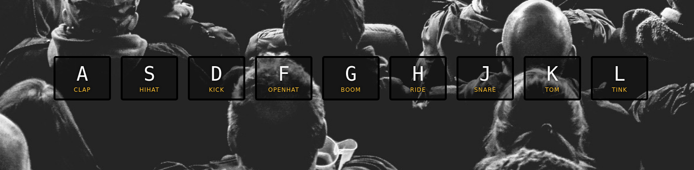

# JavaScript30 - 01 JavaScript Drum Kit

This comes from the [JavaScript30](https://javascript30.com/) course by Wes Bos

Here we build a drum kit with javascript. Press one of the presented keys to play the sound :sound:

